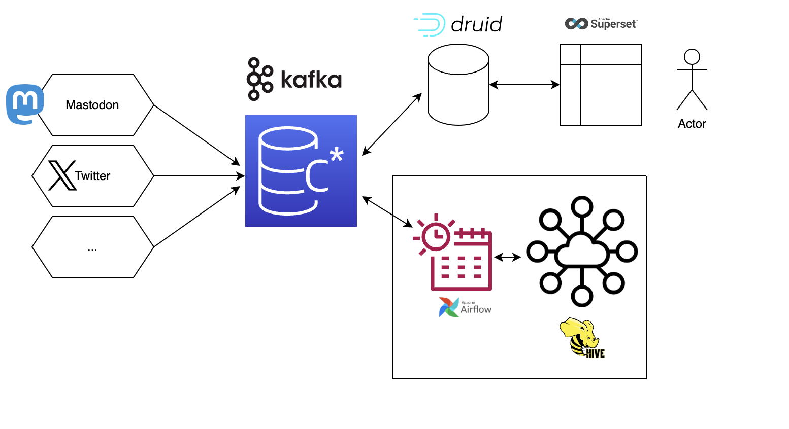

# mastodon-feed
Python app used for streaming mastodon hastags into kafka topics

## Pre-requisites
- Docker - https://www.docker.com/get-started/
- Docker Compose - https://docs.docker.com/compose/install/
- Create a access token for your mastodon account - https://docs.joinmastodon.org/api/guidelines/#making-authenticated-requests
- Create .env file with the following variables:
```
MASTODON_INSTANCE_URL=https://mastodon.social
MASTODON_ACCESS_TOKEN=xxxxxxxxxxxxxxxxxxxxxxxxxxxxxxxxxxxxxxxxxxxxxxxxxxxxxxxxxxxxxxxx
HASHTAG=retail
KAFKA_TOPIC=mastodon
```

## How to run
- Run `docker-compose build` to build the containers
- Run `docker-compose up -d` to start the containers
- Run `docker-compose logs -f` to see the logs
- Run `docker-compose down` to stop the containers

## Architecture
